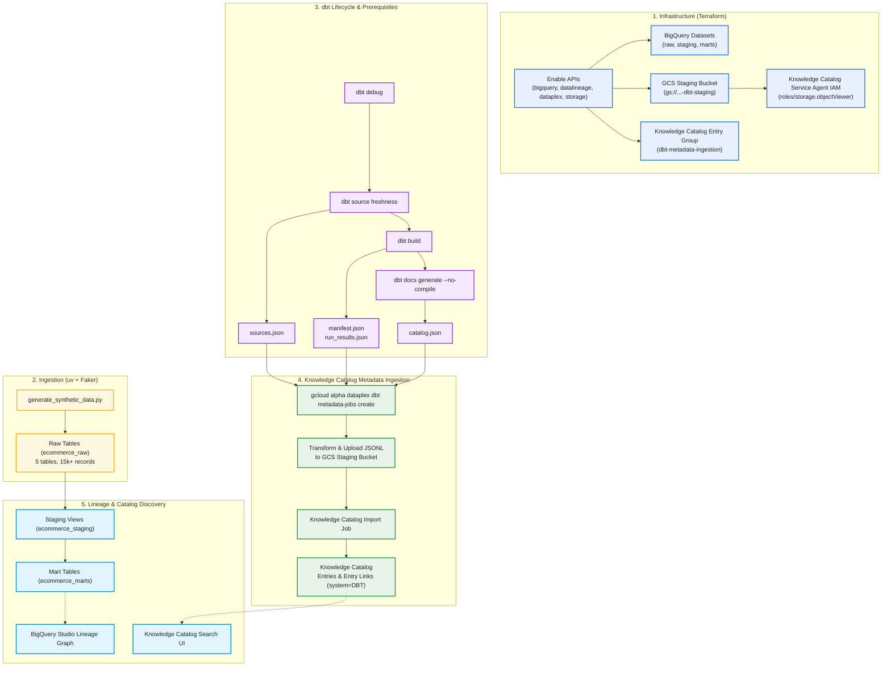
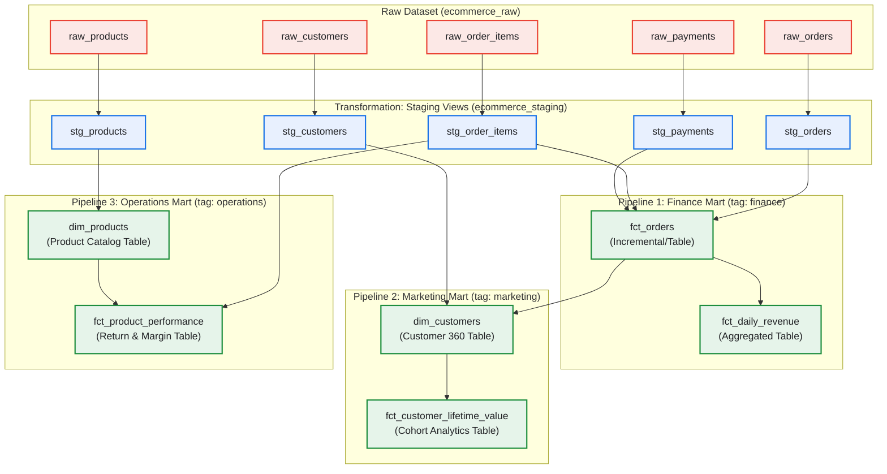

# dbt BigQuery Multi-Pipeline Demo with Data Lineage and Metadata

[](LICENSE)
[](https://www.getdbt.com/)
[](https://cloud.google.com/bigquery)
[](https://cloud.google.com/dataplex)
[](https://www.terraform.io/)
[](https://www.python.org/)
[](https://github.com/astral-sh/uv)

A reproducible, enterprise-grade demonstration of **dbt Core** running on **Google BigQuery**, featuring:
1. **Multi-Hop Data Pipelines & Lineage**: Automatic lineage capture across datasets (`ecommerce_raw` $\rightarrow$ `ecommerce_staging` $\rightarrow$ `ecommerce_marts`) in Google Cloud **Data Lineage API** and **BigQuery Studio**.
2. **Knowledge Catalog Metadata Ingestion**: Full dbt Core & MetricFlow metadata transfer (models, sources, documentation, tests, and freshness) into **Knowledge Catalog** following the official [Google Cloud dbt Metadata Transfer Specification](https://docs.cloud.google.com/dataplex/docs/dbt-transfer).

---

## 📑 Table of Contents

- [🏛️ Architecture & End-to-End Workflow](#architecture)
- [📊 dbt Pipelines & Lineage DAG](#pipelines)
- [📋 Knowledge Catalog dbt Metadata Ingestion Details](#metadata-ingestion)
- [📁 Repository Structure](#repository-structure)
- [🛠️ Prerequisites](#prerequisites)
- [🚀 Running the Demo](#running-the-demo)
- [🔍 Exploring Data Lineage in BigQuery Studio](#exploring-lineage)
- [📚 Exploring Imported dbt Metadata in Knowledge Catalog](#exploring-metadata)
- [🧹 Teardown & Cleanup](#cleanup)
- [🤝 Contributing](#contributing)
- [📄 License](#license)
- [👤 Author & Acknowledgments](#author)

---

## <a id="architecture"></a>🏛️ Architecture & End-to-End Workflow

The demo brings together **Terraform**, **uv / Python**, **dbt Core**, **BigQuery**, and **Knowledge Catalog**:



---

## <a id="pipelines"></a>📊 dbt Pipelines & Lineage DAG

The data model reflects an e-commerce platform across 3 domain-specific pipelines:



---

## <a id="metadata-ingestion"></a>📋 Knowledge Catalog dbt Metadata Ingestion Details

Google Cloud Knowledge Catalog supports native dbt-core metadata ingestion via the `gcloud alpha dataplex dbt metadata-jobs` CLI tool suite. This transfers the logical dbt graph, schema definitions, test results, column descriptions, and freshness metadata directly into Google Cloud's centralized data governance catalog.

### 1. The 4 Required Artifacts & Prerequisites

As specified in the [Google Cloud Knowledge Catalog dbt Transfer Prerequisites](https://docs.cloud.google.com/dataplex/docs/dbt-transfer#dbt-prerequisites), producing the full set of dbt metadata requires generating all 4 artifact JSON files:

| Artifact File | Required / Optional | Generation Command | Content Ingested by Knowledge Catalog |
|---|---|---|---|
| **`manifest.json`** | **Required** | `dbt build` | Full DAG topology, model configs, raw & compiled SQL, documentation, column descriptions, and MetricFlow semantic models/metrics. |
| **`catalog.json`** | Recommended | `dbt docs generate --no-compile` | Physical column data types, table byte sizes, and row counts. *(Without this, schema aspects import with untyped columns).* |
| **`run_results.json`** | Recommended | `dbt build` | Data quality test outcomes (`pass`, `warn`, `fail`), execution timings, and model build statuses. |
| **`sources.json`** | Recommended | `dbt source freshness` | Source table freshness evaluation, observation timestamps, max loaded timestamps, and SLA adherence. |

### 2. Execution Command Sequence Best Practice

The order of commands is critical:
```bash
# Step A: Evaluate source freshness (produces target/sources.json)
dbt source freshness

# Step B: Build models and execute all tests (produces target/manifest.json and target/run_results.json)
dbt build

# Step C: Generate catalog documentation WITHOUT re-compilation (produces target/catalog.json)
dbt docs generate --no-compile
```

> [!WARNING]
> **Why `--no-compile` is critical**: Running standard `dbt docs generate` triggers a dry compilation run that replaces `target/run_results.json` with a dummy run where every node is marked as successful. Passing `--no-compile` preserves the authentic test results from `dbt build`, ensuring Knowledge Catalog accurately reflects test failures or warnings.

### 3. Source Freshness Configuration (`sources.yml`)

In order for `dbt source freshness` to check tables and output `sources.json`, each raw table must declare a `loaded_at_field` and `freshness` criteria. Under dbt 1.8+, these reside under `config`:

```yaml
version: 2

sources:
  - name: raw_ecommerce
    database: "{{ env_var('GCP_PROJECT_ID') }}"
    schema: "{{ env_var('DBT_DATASET_PREFIX', 'ecommerce') }}_raw"
    tables:
      - name: raw_orders
        description: "Raw transactional order headers"
        config:
          loaded_at_field: order_timestamp
          freshness:
            warn_after: {count: 2, period: day}
            error_after: {count: 7, period: day}
      - name: raw_customers
        description: "Raw customer registration records"
        config:
          loaded_at_field: signup_date
          freshness:
            warn_after: {count: 7, period: day}
            error_after: {count: 30, period: day}
```

### 4. Infrastructure & IAM Requirements

The following resources are provisioned automatically via Terraform:
- **APIs**: `dataplex.googleapis.com` (Knowledge Catalog API), `datacatalog.googleapis.com`, `datalineage.googleapis.com`, `bigquery.googleapis.com`, `storage.googleapis.com`.
- **Knowledge Catalog Entry Group**: `google_dataplex_entry_group` (default ID: `dbt-metadata-ingestion`).
- **GCS Staging Bucket**: `google_storage_bucket` (`${PROJECT_ID}-${PREFIX}-dbt-staging`) where transformed metadata is uploaded.
- **Service Agent IAM**: The Knowledge Catalog Service Agent (`service-PROJECT_NUM@gcp-sa-dataplex.iam.gserviceaccount.com`) is granted `roles/storage.objectViewer` on the staging bucket.

### 5. Running the Metadata Ingestion Job

The `run_demo.sh` orchestrator invokes the Knowledge Catalog metadata job command:

```bash
gcloud alpha dataplex dbt metadata-jobs create \
    --project="${GCP_PROJECT_ID}" \
    --location="${GCP_REGION}" \
    --artifacts-path="dbt/target" \
    --entry-group="${DATAPLEX_ENTRY_GROUP}" \
    --storage-uri="gs://${STAGING_BUCKET}/dbt-imports/"
```

#### CLI Flag Reference:
- `--artifacts-path`: Directory containing the 4 JSON artifacts (defaults to `dbt/target`).
- `--entry-group`: The destination Knowledge Catalog Entry Group in your project and location.
- `--storage-uri`: Cloud Storage folder prefix used by `gcloud` to stage the transformed `dbt_metadata.jsonl`.
- `--validate-only`: (Optional) Builds and uploads the JSONL file and validates the job schema without ingesting.
- `--aspects-only`: (Optional) For routine scheduled runs. Updates metadata observed in this run without pruning absent entries.
- `--include-entry-links`: (Default: true) Automatically creates `EntryLink` records capturing:
  - **dbt Relationships**: References connecting tests to models and macros.
  - **Physical Table Links**: Binds dbt logical entries to the physical `@bigquery` table entries in Knowledge Catalog.

---

## <a id="repository-structure"></a>📁 Repository Structure

```
.
├── .env.example                  # Template configuration for project, region, and entry group
├── .env                          # Local active environment configuration (gitignored)
├── .gitignore                    # Standard ignore rules
├── pyproject.toml                # uv Python project configuration
├── uv.lock                       # Locked Python dependencies
├── run_demo.sh                   # All-in-one execution orchestrator
├── cleanup.sh                    # Automated resource destruction script
├── README.md                     # Complete demo guide & documentation
│
├── terraform/                    # Infrastructure as Code
│   ├── main.tf                   # Enables APIs, BigQuery datasets, Knowledge Catalog entry group, GCS bucket, and IAM
│   ├── variables.tf              # Configurable project, region, dataset prefix, entry group
│   └── outputs.tf                # Provisioned resource IDs
│
├── scripts/                      # Synthetic data generation
│   └── generate_synthetic_data.py # Faker script populating relational raw BigQuery tables
│
└── dbt/                          # dbt Core project
    ├── dbt_project.yml           # dbt project definition and materialization config
    ├── profiles.yml              # BigQuery connection profile (reads from .env)
    ├── macros/
    │   └── generate_schema_name.sql # Custom schema routing macro
    └── models/
        ├── sources.yml           # Declarations of raw tables with freshness SLAs and tests
        ├── staging/              # Staging views (cleansing, typing, naming)
        │   ├── stg_customers.sql, stg_products.sql, stg_orders.sql, ...
        │   └── staging.yml
        └── marts/                # Production analytics tables
            ├── finance/          # Pipeline 1: fct_orders, fct_daily_revenue (tag: finance)
            ├── marketing/        # Pipeline 2: dim_customers, fct_customer_lifetime_value (tag: marketing)
            └── operations/       # Pipeline 3: dim_products, fct_product_performance (tag: operations)
```

---

## <a id="prerequisites"></a>🛠️ Prerequisites

Ensure the following tools are installed on your machine:

1. **Google Cloud SDK (`gcloud`)**:
   ```bash
   gcloud --version
   ```
2. **Terraform** ($\ge$ 1.5.0):
   ```bash
   terraform -version
   ```
3. **uv** (Fast Python package manager):
   ```bash
   uv --version
   ```
   *To install uv:*
   ```bash
   curl -LsSf https://astral.sh/uv/install.sh | sh
   ```
4. **Google Cloud Authentication**:
   Login with Application Default Credentials (ADC):
   ```bash
   gcloud auth login
   gcloud auth application-default login
   ```

---

## <a id="running-the-demo"></a>🚀 Running the Demo

### 1. Clone the Repository

```bash
git clone https://github.com/nwipfli/dbt-bigquery-demo.git
cd dbt-bigquery-demo
```

### 2. Configure Environment Variables
Copy `.env.example` to `.env` and set your GCP project and region:

```bash
cp .env.example .env
```

Edit `.env`:
```ini
GCP_PROJECT_ID="your-gcp-project-id"
GCP_REGION="us-central1"
DBT_DATASET_PREFIX="ecommerce"
DATAPLEX_ENTRY_GROUP="dbt-metadata-ingestion"
```

### 3. Execute the All-in-One Orchestrator
Run the provided runner script:

```bash
./run_demo.sh
```

### Detailed Breakdown of What `run_demo.sh` Does:

The orchestrator script automates the complete lifecycle in 5 structured steps:

#### Step 1: Pre-flight Verification & Environment Setup
- Validates the presence of required local CLI utilities (`gcloud`, `terraform`, and `uv`).
- Checks for `.env` and exports environment variables (`GCP_PROJECT_ID`, `GCP_REGION`, `DBT_DATASET_PREFIX`, `DATAPLEX_ENTRY_GROUP`, `TF_VAR_*`, and `DBT_PROFILES_DIR`).

#### Step 2: Infrastructure Provisioning (Terraform)
- Initializes and executes `terraform apply -auto-approve` non-interactively:
  - Enables necessary GCP APIs: `bigquery.googleapis.com`, `datalineage.googleapis.com`, `datacatalog.googleapis.com`, `dataplex.googleapis.com`, and `storage.googleapis.com`.
  - Creates 3 isolated BigQuery datasets: `${DBT_DATASET_PREFIX}_raw`, `${DBT_DATASET_PREFIX}_staging`, and `${DBT_DATASET_PREFIX}_marts`.
  - Provisions the Knowledge Catalog Entry Group (`dbt-metadata-ingestion`).
  - Provisions the Cloud Storage metadata staging bucket (`${PROJECT_ID}-${DBT_DATASET_PREFIX}-dbt-staging`).
  - Configures IAM role binding granting `roles/storage.objectViewer` on the staging bucket to the Knowledge Catalog Service Agent (`service-${PROJECT_NUM}@gcp-sa-dataplex.iam.gserviceaccount.com`).

#### Step 3: Python Environment & Synthetic Data Ingestion
- Executes `uv sync` to install dependencies and activate the Python virtual environment.
- Runs `uv run python scripts/generate_synthetic_data.py` to generate relational mock data using Faker and stream records into the 5 raw tables in `${DBT_DATASET_PREFIX}_raw` (1,000 customers, 150 products, 4,000 orders, 9,950 order items, 3,332 payments).

#### Step 4: Complete dbt Lifecycle & Metadata Prerequisites
Executes dbt commands in the exact sequence required for full Knowledge Catalog metadata capture:
1. **Verifying Warehouse Connection (`dbt debug`)**:
   Runs `uv run dbt debug --project-dir dbt --profiles-dir dbt` to validate BigQuery credentials, adapter connectivity, database location, and `profiles.yml` / `dbt_project.yml` syntax prior to execution.
2. **Checking Source Table Freshness (`dbt source freshness`)**:
   Runs `uv run dbt source freshness --project-dir dbt --profiles-dir dbt` to evaluate table observation timestamps against configured SLA criteria and output `dbt/target/sources.json`.
3. **Building Models & Executing Tests (`dbt build`)**:
   Runs `uv run dbt build --project-dir dbt --profiles-dir dbt` to compile and materialize all 5 staging views, all 6 production mart tables (finance, marketing, and operations), execute all 35 data quality schema tests, and produce `dbt/target/manifest.json` and `dbt/target/run_results.json`.
4. **Generating Catalog Documentation (`dbt docs generate --no-compile`)**:
   Runs `uv run dbt docs generate --project-dir dbt --profiles-dir dbt --no-compile` to inspect the BigQuery information schema, extract column names, data types, row counts, and table sizes into `dbt/target/catalog.json`. Crucially, passing `--no-compile` prevents dbt from overwriting test outcomes in `run_results.json`.
5. **Artifact Verification**:
   Inspects the `dbt/target/` directory to ensure all 4 JSON artifacts (`manifest.json`, `catalog.json`, `run_results.json`, `sources.json`) are present and valid.

#### Step 5: Knowledge Catalog Metadata Ingestion
- Resolves the staging bucket URI (`gs://${GCP_PROJECT_ID}-${DBT_DATASET_PREFIX}-dbt-staging/dbt-imports/`) and Entry Group (`dbt-metadata-ingestion`).
- Invokes `gcloud alpha dataplex dbt metadata-jobs create` to transform local dbt artifacts into `dbt_metadata.jsonl`, stage them in Cloud Storage, and execute the Knowledge Catalog import job.
- Registers 53 metadata entries and 62 entry links directly into Knowledge Catalog.

---

## <a id="exploring-lineage"></a>🔍 Exploring Data Lineage in BigQuery Studio

When dbt runs BigQuery SQL transformations, BigQuery automatically emits lineage events to the Google Cloud Data Lineage API.

### Exploration Steps:
1. Open the [Google Cloud BigQuery Studio Console](https://console.cloud.google.com/bigquery).
2. In the Explorer pane, expand dataset: **`ecommerce_marts`**.
3. Click on **`fct_daily_revenue`** or **`dim_customers`**.
4. In the details panel on the right, click the **Lineage** tab.
5. Inspect the interactive graph:
   - Traces `fct_daily_revenue` $\rightarrow$ `fct_orders` $\rightarrow$ staging views $\rightarrow$ raw tables!
   - Traces `dim_customers` to both `stg_customers` and `fct_orders` (demonstrating cross-mart dependency).

---

## <a id="exploring-metadata"></a>📚 Exploring Imported dbt Metadata in Knowledge Catalog

Once metadata ingestion completes, all dbt project metadata is searchable and viewable directly in Knowledge Catalog:

### Exploration Steps:
1. Open the [Knowledge Catalog Search Page](https://console.cloud.google.com/dataplex/dp-search).
2. Filter or Search:
   - Enter `system=DBT` in the search bar, **OR**
   - In the Filters panel, select:
     **System** $\rightarrow$ **Imported Context** $\rightarrow$ **Managed Connectors** $\rightarrow$ **dbt**.
3. Click on any model (e.g. `ecommerce_marts.fct_orders`):
   - **Overview**: Model description, tags (`finance`), materialization type (`table`/`incremental`/`view`).
   - **Schema & Columns**: Physical data types, column descriptions, and primary key constraints extracted from `catalog.json`.
   - **Data Quality & Tests**: Live test outcomes from `run_results.json` showing pass/warn/fail status for each test.
   - **Source Freshness**: Max loaded dates and freshness SLA compliance status from `sources.json`.
   - **SQL Code**: Raw and compiled SQL logic directly inspectable in the UI.
   - **Entry Links**: Direct links between dbt logical model entries and physical BigQuery `@bigquery` table entries.

### Routine Re-runs (`--aspects-only`)
For regular pipeline runs where models have not been added or deleted, update only the observed run aspects without modifying the entry hierarchy:
```bash
gcloud alpha dataplex dbt metadata-jobs create \
    --project="${GCP_PROJECT_ID}" \
    --location="${GCP_REGION}" \
    --artifacts-path="dbt/target" \
    --entry-group="dbt-metadata-ingestion" \
    --storage-uri="gs://${GCP_PROJECT_ID}-${DBT_DATASET_PREFIX}-dbt-staging/dbt-imports/" \
    --aspects-only
```

---

## <a id="cleanup"></a>🧹 Teardown & Cleanup

To destroy all provisioned BigQuery datasets, tables, Knowledge Catalog entry groups, and GCS buckets:

```bash
./cleanup.sh
```
*(Or `./run_demo.sh --destroy`)*

---

## <a id="contributing"></a>🤝 Contributing

Contributions, feedback, and issue reports are welcome!

1. **Issues**: If you discover a bug, edge case, or have an enhancement suggestion, please open an issue in the [GitHub Issue Tracker](https://github.com/nwipfli/dbt-bigquery-demo/issues).
2. **Pull Requests**:
   - Fork the repository and create a feature branch (`git checkout -b feature/my-feature`).
   - Ensure SQL formatting and dbt modeling conventions are followed.
   - Commit your changes with clear, conventional messages (`git commit -m "feat: add customer retention mart"`).
   - Push to your branch (`git push origin feature/my-feature`) and open a Pull Request.

---

## <a id="license"></a>📄 License

This project is licensed under the **Apache License, Version 2.0**.

See the [LICENSE](LICENSE) file for the full license text and terms.

```text
Copyright 2026 Nicolas Wipfli

Licensed under the Apache License, Version 2.0 (the "License");
you may not use this file except in compliance with the License.
You may obtain a copy of the License at

    http://www.apache.org/licenses/LICENSE-2.0

Unless required by applicable law or agreed to in writing, software
distributed under the License is distributed on an "AS IS" BASIS,
WITHOUT WARRANTIES OR CONDITIONS OF ANY KIND, either express or implied.
See the License for the specific language governing permissions and
limitations under the License.
```

---

## <a id="author"></a>👤 Author & Acknowledgments

- **Author**: Nicolas Wipfli ([@nwipfli](https://github.com/nwipfli))
- **Documentation References**:
  - [Google Cloud Data Lineage Overview](https://cloud.google.com/data-catalog/docs/concepts/about-data-lineage)
  - [Google Cloud Knowledge Catalog dbt Metadata Transfer](https://docs.cloud.google.com/dataplex/docs/dbt-transfer)
  - [dbt-bigquery Documentation](https://docs.getdbt.com/reference/warehouse-setups/bigquery-setup)
